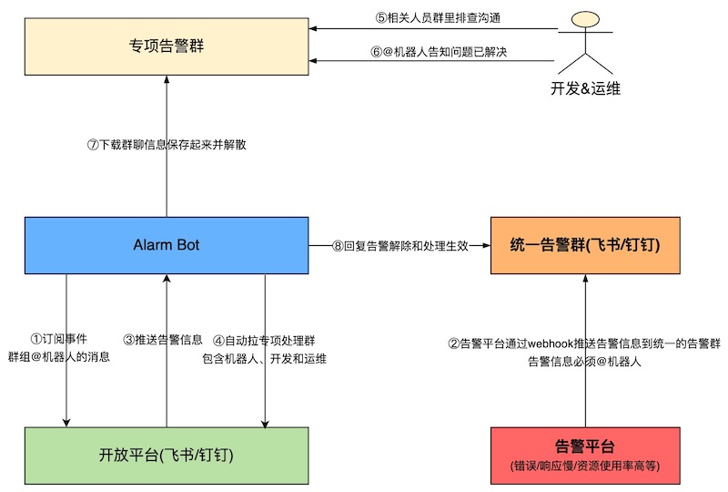

# Alarm Bot

## 项目介绍

> Alarm Bot中文名"告警机器人"，通过三方平台的开放能力，完成告警 -> 创建群 -> 拉人进群 -> 解决告警的闭环。针对未及时处理的告警提醒相关人员及时跟进处理，确保不会遗漏。

项目结构如下：

## 技术设计

</img>

## 未来计划

- 完善`alarm-bot-backend`，后台支持项目、成员的配置；
- 项目支持Owner和Member的角色，便于日常管理；
- 支持钉钉；
- 支持企业微信。